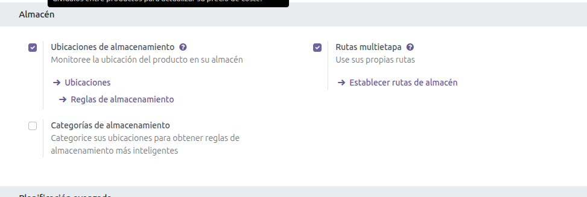
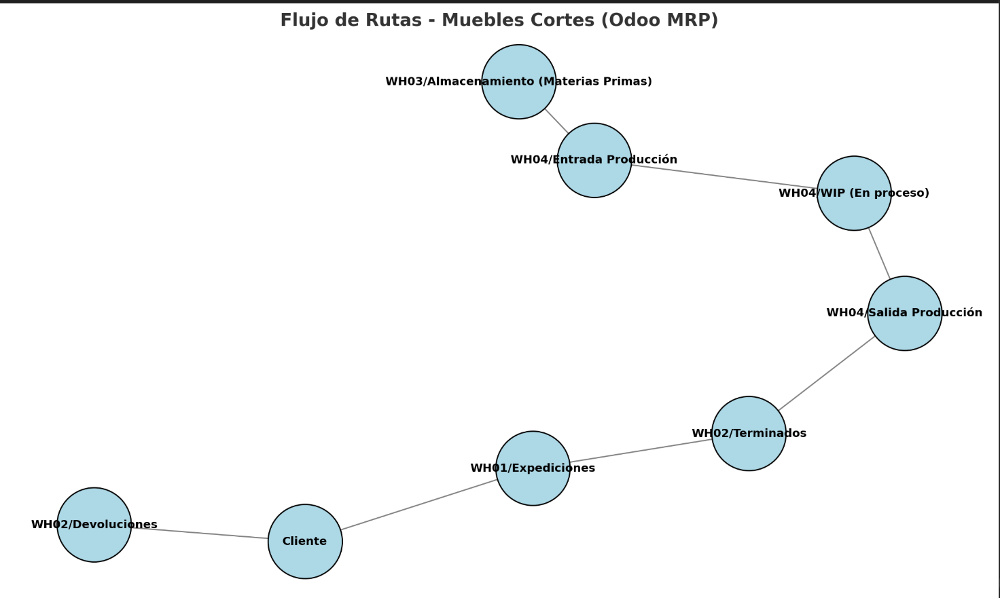
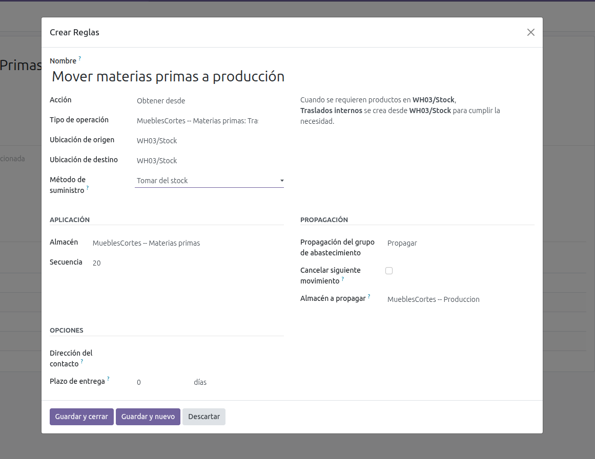
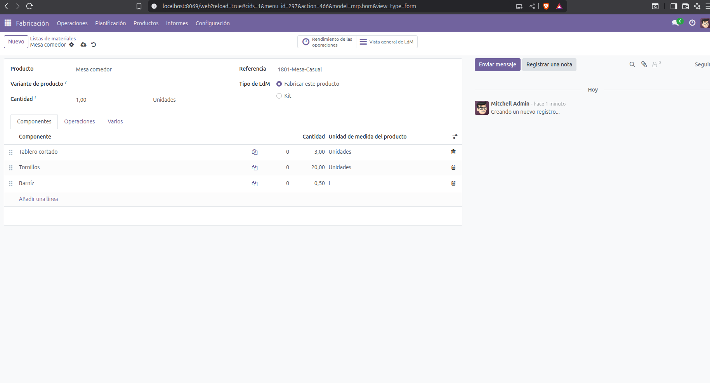
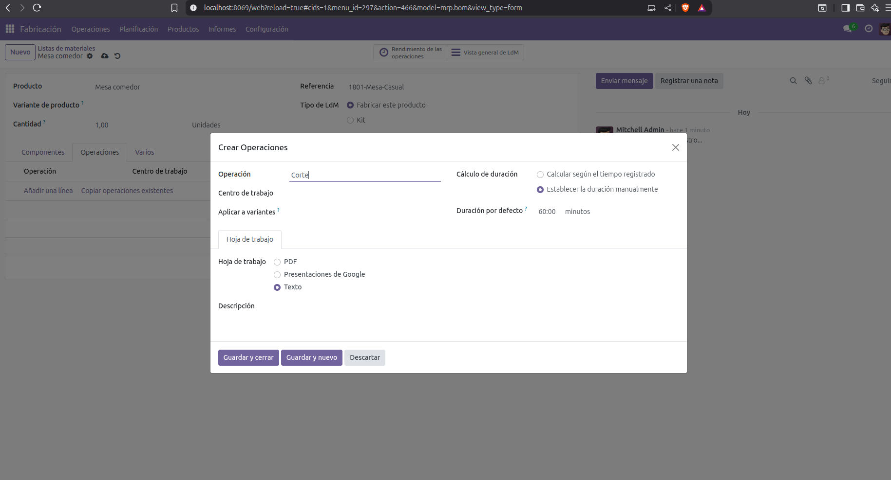
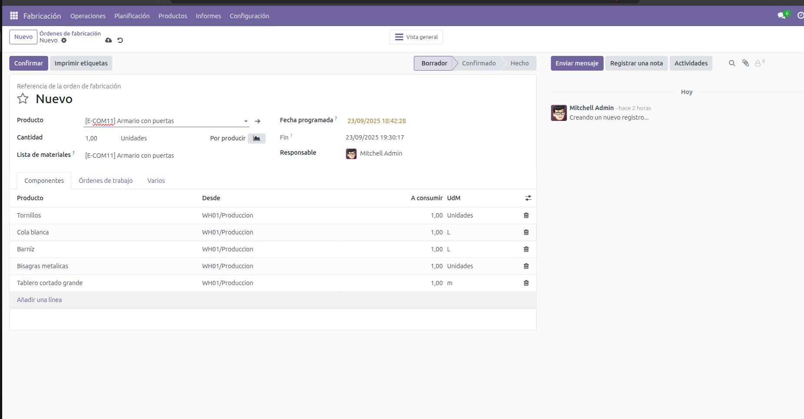
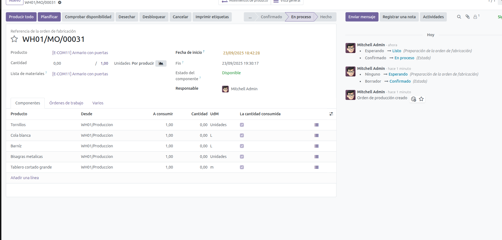
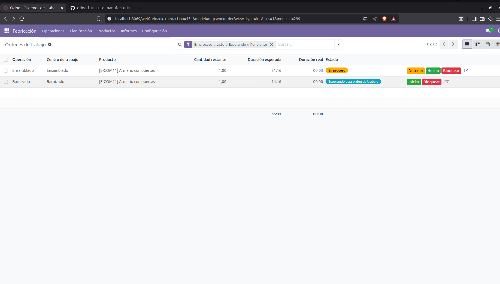
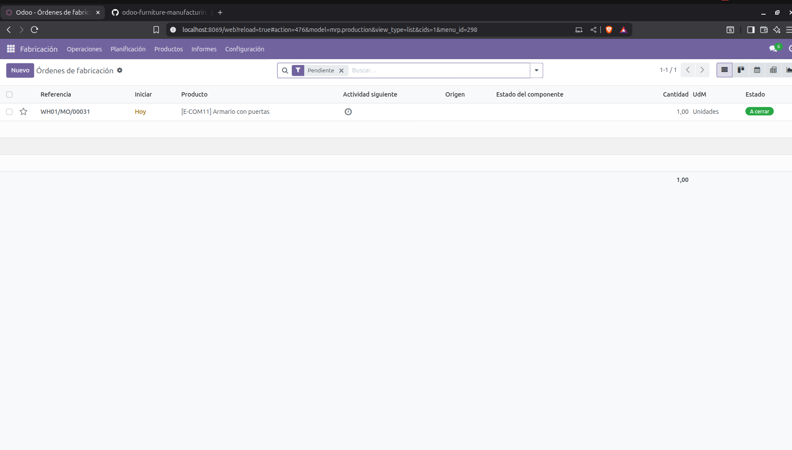
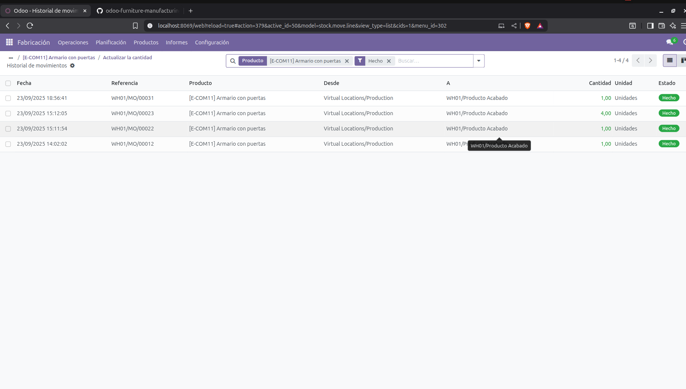

# MRP.

**MRP --> Es un sistema que calcula que materiales son necesarios en qué cantidades y en qué momentos para poder fabricar productos acabados**

## RUTAS.

Antes de adentrarnos de lleno en la manufacturación de productos, tenemos que definir la parte que conecta todos nuestros modulos. Las rutas.

**Una ruta es una regla logistica que define como se mueve un producto dentro de la empresa.**

Para activar las rutas tenemos que realizar el mismo procedimiento que con los almacenes. Hay que activar las rutas multietapas justamente al lado de almacenes.

.

Una vez activada la configuración, es muy importante analizar los almacenes de la empresa las rutas que hay, y hacer un esquema del proceso que seguira nuestro producto. 

Aqui dejo explicado y con un diagrama que he realizado para tener la mayor idea de la pipeline que seguira nuestro producto. 

.

1. Materias Primas → Producción

    -Acción: Obtener desde (Pull).
    -Origen: WH01/Materia prima.
    -Destino: WH01/Producción.
    📌 Permite que al lanzar una orden de producción, Odoo jale materiales desde el almacén de Materias Primas.

2. Producción-> Semielaborados

    -Acción: Empujar a .
    -Origen: WH01/Producción.
    -Destino: WH01/Semielaborados.
    📌 Simula que las materias primas  han terminado el proceso de fabricación (semielaborados) y se les envia a su ubicación.

3. Semielaborados -> Producción 

    -Acción: Obtener desde.
    -Origen: WH01/Semielaborados.
    -Destino: WH01/Producción.
    📌 Los productos semielaborados osn llevados a producción para montar un producto acabado.

4. Producción → Productos acabado

    -Acción: Empujar a .
    -Origen: WH01/Producción.
    -Destino: WH01/Producto Acabado.
    📌 Mueve los productos terminados al almacén de terminados listos para venta.

5. Producto acabado → Expediciones

    -Acción: Obtener desde.
    -Origen: WH01/Producto acabado.
    -Destino: WH01/Expediciones.
    📌 Mueve el producto ya vendido hacia la zona de expedición.

**CON ESTAS RUTAS YA TENDRIAMOS EL FLUJO COMPLETO Compra → Materias Primas → Producción → Terminados → Expediciones → Cliente **

.

Preparamos nuestra ruta, es super importante la parte inferior de reglas añadir linea. Se nos abrirá un formulario, donde nosotros vamos a rellenar depende del tipo de operacion y la acción que queramos hacer. 

Como será un flujo la gran mayoria serán pulls Obtener desde. Excptuando el de devoluciones de clientes que será push al almacén de devoluciones.

.

## .BoM

Antes de adentrarnos en las ordenes de fabricación y en las ordenes de trabajo, nos vamos a centrar en el BoM. El BoM es la descomposición de un producto.
Es decir, de los materiales que componen un producto. Menos la materia prima todos tendran un BoM. Por ejemplo, los semielaborados aunque no sean vendibles directamente. Estan compuestos por varios elementos de Materia prima.
En nuestro caso, hemos definido las piezas barnizadas, y su BoM es un tablero cortado y 1 litro de Barníz. El tablero cortado hemos definido que se hacer mediante 5m de madera de roble para conseguir 1 metro.

En Fabricación -> Productos -> Lista Materiales vamos a encontrar para hacer el BoM.

**Hay que tener presente que todo en una industria son flujos de procesos. De la materia prima, se preparar semielaborados, estos van a ser los que compongan los productos acabados listos para la venta**

.

Mientras asignamos el BoM, tambien vamos a preparar las "Operaciones" que son las accioens que se realizarán en los puestos de trabajo para elaborar el material. Cuando hemos definido los materiales y la cantidad en cada BoM. Vamos a proceder a las operaciones. 

.

Aqui en las operaciones vamos a definir la acción que se hace en cada lugar de trabajo y el tiempo estimado que se tarda en realizar la acción.

Posteriormente en los BoMs vamos a definir que tipo de operación tiene el BoM. Es importante, ya que nos sirve para indicar si estamos fabricando un semielaborado o un producto acabado.
En nuestra configuración del almacen, los semielaborados van en una ubicación y los productos acabados van en otra.

## .MO(ORDEN FABRICACIÓN) WO(ORDEN DE TRABAJO).

-Las siglas MO -> significa manufacturing order -> orden de fabricación y WO -> work order -> orden de trabajo.

-A continuación, vamos a proceder a crear las ordenes de fabricación. En las ordenes de fabricación, más adelante vamos a enlazar con los pedidos, marcan cuantas unidades se tienen de fabricar. Más bien dicho, se pasa el pedido a la fabrica para que lo fabriquen.

-Primero de todo vamos a seleccionar el articulo que queremos, alli se nos va a desplegar el BoM.
.
-Siguiente paso cuando vemos que esta todo correcto es darle a confirmar. Nos va a crear un numero de secuencia en automaticamente que va a ser el numero de la orden. 
-Vamos a seleccionar los componentes y vamos a pulsar si hay disponibilidad 
.

-Una vez hemos visto que hay disponibilidad, vamos a proceder a pulsar planificar, para que se pongan en marcha las Ordenes de trabajo.

-Vamos a la seccion Ordenes-> Ordenes de trabajo. Y allí, vamos a ver todas las ordenes de trabajo que hay. Si pone listo como es nuestro caso, singnifica que ya estan preparados los componentes, es decir que ya estan en la ubicacion preparados para montar. Si no fuera el caso se tendría que realizar un traslado, o la ruta  no estaría bien configurada.

-Le damos a empezar las ordenes y veremos que empieza un contador, es una simulación del tiempo que tarda en hacerse la orden. Como antes en los centros de trabajo hemos establecido que se calcule el timepo de media en base a las ultimas 4.
.
-Le damos a listo, ya que estamos en una demo

Una vez hemos terminado con las ordenes, procedemos a las ordenes de fabricación y vamos a ver que pone a cerrar. JUstamente entramos y pulsamos producir todo, así Odoo va a hacer los traslados de stock. Restar materias primas, sumar o restar productos semiterminados y/o sumar productos acabados. 

.

**Finalmente vamos a comprobar si se ha creado el producto acabado ***

.

