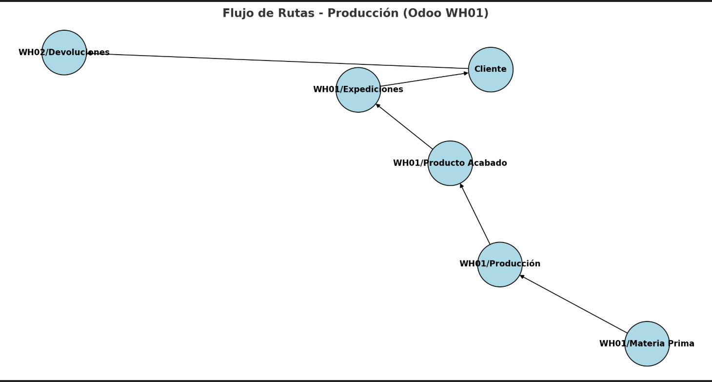

# MRP.

**MRP --> Es un sistema que calcula que materiales son necesarios en qué cantidades y en qué momentos para poder fabricar productos acabados**

## RUTAS.

Antes de adentrarnos de lleno en la manufacturación de productos, tenemos que definir la parte que conecta todos nuestros modulos. Las rutas.

**Una ruta es una regla logistica que define como se mueve un producto dentro de la empresa.**

Para activar las rutas tenemos que realizar el mismo procedimiento que con los almacenes. Hay que activar las rutas multietapas justamente al lado de almacenes.

.

Una vez activada la configuración, es muy importante analizar los almacenes de la empresa las rutas que hay, y hacer un esquema del proceso que seguira nuestro producto. 

Aqui dejo explicado y con un diagrama que he realizado para tener la mayor idea de la pipeline que seguira nuestro producto. 

.

1. Materias Primas → Producción

    -Acción: Obtener desde (Pull).
    -Origen: WH03/Almacenamiento.
    -Destino: WH04/Entrada a Producción.
    📌 Permite que al lanzar una orden de producción, Odoo jale materiales desde el almacén de Materias Primas.

2. Producción (Entrada → WIP)

    -Acción: Obtener desde.
    -Origen: WH04/Entrada a Producción.
    -Destino: WH04/WIP.
    📌 Simula que las materias primas entran al proceso de fabricación (semielaborados).

3. Producción (WIP → Salida Producción)

    -Acción: Obtener desde.
    -Origen: WH04/WIP.
    -Destino: WH04/Salida de Producción.
    📌 Una vez terminadas, las piezas salen como producto acabado.

4. Producción → Productos Terminados

    -Acción: Obtener desde.
    -Origen: WH04/Salida de Producción.
    -Destino: WH02/Terminados.
    📌 Mueve los productos terminados al almacén de terminados listos para venta.

5. Terminados → Expediciones

    -Acción: Obtener desde.
    -Origen: WH02/Terminados.
    -Destino: WH01/Expediciones.
    📌 Mueve el producto ya vendido hacia la zona de expedición.

**CON ESTAS RUTAS YA TENDRIAMOS EL FLUJO COMPLETO Compra → Materias Primas → Producción → Terminados → Expediciones → Cliente **

.

Preparamos nuestra ruta, es super importante la parte inferior de reglas añadir linea. Se nos abrirá un formulario, donde nosotros vamos a rellenar depende del tipo de operacion y la acción que queramos hacer. 

Como será un flujo la gran mayoria serán pulls Obtener desde. Excptuando el de devoluciones de clientes que será push al almacén de devoluciones.

.

## .

## .

