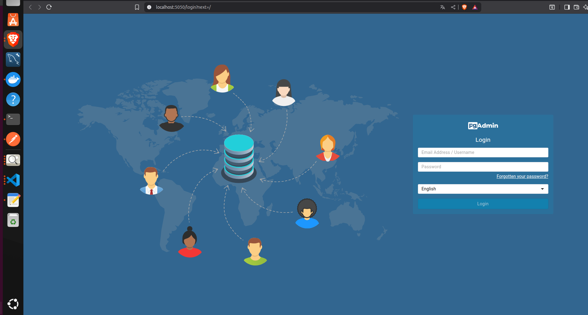
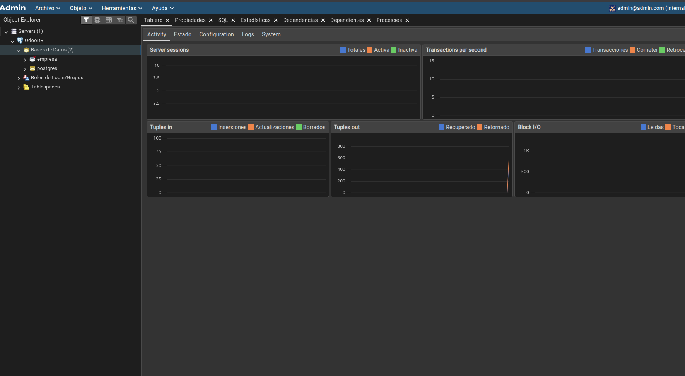

# DOCKER

-Para no tener que descargarnos todo el core de Odoo, desde su repositorio en nuestro ordenador. Vamos a crear 3 servicios distintos.

Primero de todo vamos a crear nuestro docker compose definiendo la imagen de Odoo, la imagen de la db(PostgreeSQL) y finalmente para facilidad de visualizacion de datos otro servicio de pgadmin.

-Para buenas practicas intentaremos subir nuestra imagen a Docker Hub

.

Posteriormente nuestro Docker Deskyop tiene que quedar con esta estructura, tal y como indica el docker-compose.

.
---
**Por seguridad** creamos el archivo .gitignore, que tendria la estructura que vemos en el archivo de la raiz. Con el fin de no subir nuestras claves que estan en odoo.conf al repositorio.(Aunque sea un proyecto de demo, se seguiran buenas practicas).

## 2-PASO 

Una vez tenemos estos pasos. vamos a configurar nuestro odoo.conf.

El odoo.conf es donde estan todas nuestras claves de entorno, el puerto http, la ruta del archivo de los logs y la ruta del archivo de los addons.

Quedaria una estructura así:

[options]
admin_password=
http_port=
db_host=
db_port=
db_user=
db_password=
addons_path=
logfile=

** Finalmente levantamos el contenedor mediante docker compose up -d ** 

IMPORTANTE si tienes mas contenedores no relacionados con el proyecto despues de la -d tienes que indicar los contenedores que quieres levantar. Sino levantará todos. 

## 3-PASO 

Una vez esta todo preparado y el contenedor esta levantado. Procedemos a ir a localhost:<El puerto que hayamos indicado al composer>.

-Comprobamos si Odoo esta levantado y posteriormente si nuestro pgadmin tambien esta levantado en su puerto. 

## Odoo.

Primero de todo vamos a configurar el arranque de Odoo.
.
 
 Aqui vamos a iniciar la database de Odoo. 
 Vamos a rellenar la contraseña maesra con la puesta en .conf.
 Los siguientees campos seran para crear la base de datos de la empresa ficticia que  vamos a usar. Podemos rellenar con un mail y password ficticios. Al igual que en la db.

 Como estamos en un entorno de pruebas vamos a seleccionar Demo Data, asi Odoo nos va a proporcionar todos datos de muebles de prueba(vienen por defecto). Así tenemos los productos con todos sus BOOMS y no tenemos que crearlos.

 Una vez hemos completado todo creamos la base de datos. Introducimos el correo y el password otra vez, accediendo así a la pagina inicial de Odoo.

.

## PGADMIN.

Seguidamente, hemos realizado exitosamente la creación de la base de datos. Vamos a proceder a acceder a la interfaz PGADMIN.

Vamos en el localhost en el puerto que le hemos asignado. Posteriormente a esto, introducimos en el menu de entrada el usuario que hemos puesto en el docker compose 

.

Cuando entramos en la interfaz, vamos en la parte de servers y pulsamos en register.

.

EN la parte de general el nobmre que pondremos sera el que querramos.
Despues en conexion vamos a usar los puestos en odoo.conf para poder establecer conexión con Odoo. Y nos mostrara finalmente la base de datos creada por Odoo.

.

