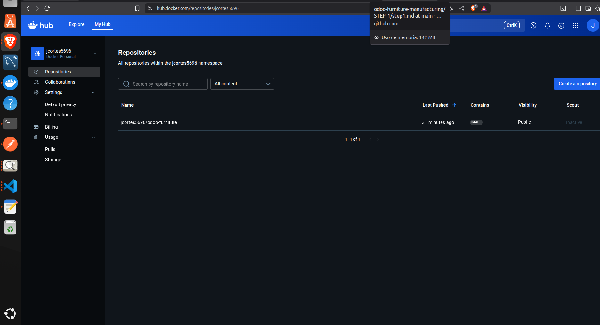
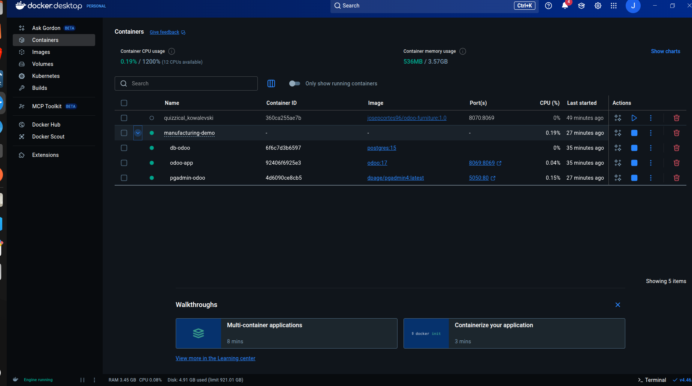

# DOCKER

-Para no tener que descargarnos todo el core de Odoo, desde su repositorio en nuestro ordenador. Vamos a crear 3 servicios distintos.

Primero de todo vamos a crear nuestro docker compose definiendo la imagen de Odoo, la imagen de la db(PostgreeSQL) y finalmente para facilidad de visualizacion de datos otro servicio de pgadmin.

-Para buenas practicas intentaremos subir nuestra imagen a Docker Hub

.

Posteriormente nuestro Docker Deskyop tiene que quedar con esta estructura, tal y como indica el docker-compose.

.
---

## 🎯 Objetivo  

## Información.

## Estructura del repositorio.
