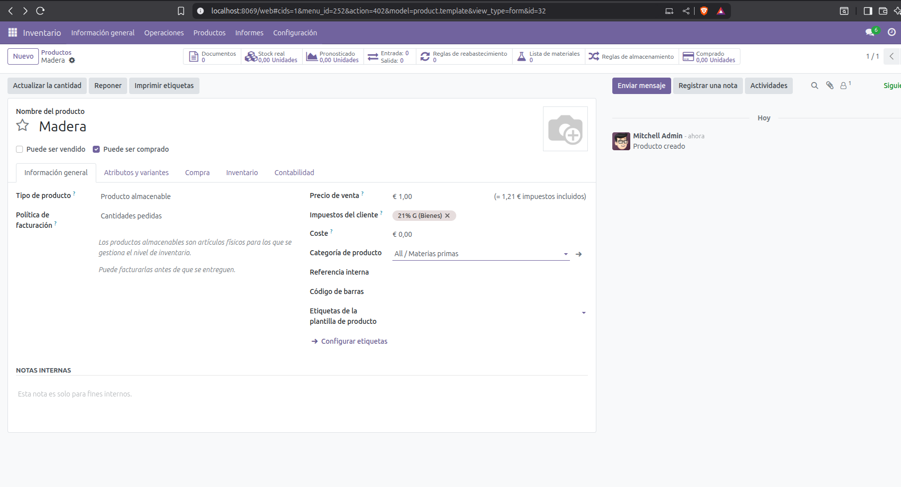

# STOCK.

## ALMACENES.

Antes de dedicarnos a crear stock, la parte primordial es crear los almacenes. Para poder estructurar mucho mejor la integración de este modulo. Vamos a configurar desde el almacén -> ubicaciones -> categoria de producto -> producto.

En la parte de inventario vamos a configuracion Ajustes -> Almacenes y una vez que estamos allí procederemos a crear nuestros 4 Almacenes.
.

En la creacion de almacenes es importante distinguir las necesidades y las capacidades de la empresa donde implantemos Odoo. En este ejemplo yo he considerado que tendra 4 Almacenes.
-Materias Primas.
-Producción.
-Central
-Expediciones.

Esto es importante porque hay de asociar como se va a rebastecer si en compra, fabricacion o más bien con traslados entre centros. 
Por lo tanto depende que tipo de almacén lo hara de una forma u otra. Ejemplo: El de materias primas, como esta compuesto de materias primas basicamente será mediante compras. Por otro lado el de Producción será mediante fabricación. Y el de expediciones mediante traslados del Central.

.

## UBICACIONES.

Una vez comprobamos que nuestros almacenes estan creados correctamente. Vamos a por la otra parte importante, las ubicaciones internas que tiene cada almacén. 

Para entender un poco el procedimiento he dividio mis almacenes de la siguiente manera.

**-MueblesCOrtes -- CENTRAL.(WH01)**

    -WH01/Materias primas.
    -WH01 Terminados.
    -WH01/Expediciones.

Es el almacén general de la empresa, desde donde se divide todo. Se almacenan materias primas terminados, se realizan pickings.  

**-MueblesCOrtes -- Expediciones.(WH02)**

    -WH02/Terminados → mesas, sillas, armarios listos para vender.
    -WH02/Devoluciones → productos defectuosos devueltos por clientes.

**-MueblesCOrtes -- Materias Primas.(WH03)**

    -WH03/Recepción → donde entran compras.
    -WH03/Almacenamiento → stock de madera, tornillos, barniz.
    -WH03/Calidad → inspección de materiales defectuosos.(Poner ubicación de deshecho)

**-MueblesCOrtes -- Materias Producción.(WH04)**

    -WH04/Entrada a Producción → materias primas que se van a usar.

    -WH04/WIP (En proceso) → semielaborados (tablero cortado, piezas barnizadas).

    -WH04/Salida de Producción → productos ya ensamblados, listos para terminar.

Creación de ubicaciones. Es importante decir que tipo de ubicación es.

Adjunto un listado de los tipos de ubicacion que hay.
Tipos de ubicaciones en Odoo

**Interna** 

    -Representa un lugar físico dentro de la empresa.

    Ejemplo: Materias primas, Producción, Productos terminados.

    -Se usan en la mayoría de flujos (consumo, fabricación, almacenamiento).

**Proveedor**

    -Se usa como origen de productos cuando haces una compra.

    Ejemplo: “Proveedor” → MueblesCortes/Materias Primas/Recepción.

**Cliente** 

    -Se usa como destino cuando haces una venta.

    Ejemplo: MueblesCortes/Expediciones/Expedición → Cliente.

**Tránsito** 

    -Representa mercancías en camino (entre almacenes).

    Ejemplo: de Almacén Central a Almacén Regional.

**Devolución** 

    -Se usa para registrar productos devueltos.

    Ejemplo: MueblesCortes/Expediciones/Devoluciones.

**Inventario** 

    -Se usa en ajustes de stock (pérdidas, roturas, diferencias de inventario).

.

.

## CREACIÓN STOCK.

El siguiente paso de nuestro flujo es la creacion del stock. Antes de todo vamos a crear las categorias así a la hora de definir los articulos vamos a poenr la categoría a la cual pertenecen.

-Dividiremos en 3 categoria: Materia prima, semielaborados, acabados.

Para crear las categorias iremos en Ajustes-> Categorias del producto.

.

Una vez tenemos las categorias creadas, iremos al apartado de producto y pulsaremos a nuevo.

Alli crearemos el articulo, le pondremos las caracteristicas que ha de tener, las unidades de medida (Se activan al lado de ubicaciones en configuración) la categoría y indicaremos en actualizar cantidad si tenemos stock inicial ya en almacén. 

.

Por ultimo le asignaremos la ubicación inicial.(Si tiene stock)

.

Finalmente vemos en el stock.

-Los elementos que nos viene de serie por Odoo y los 3 articulos de materia prima creados Tornillo, Barniz y Madera.

.

