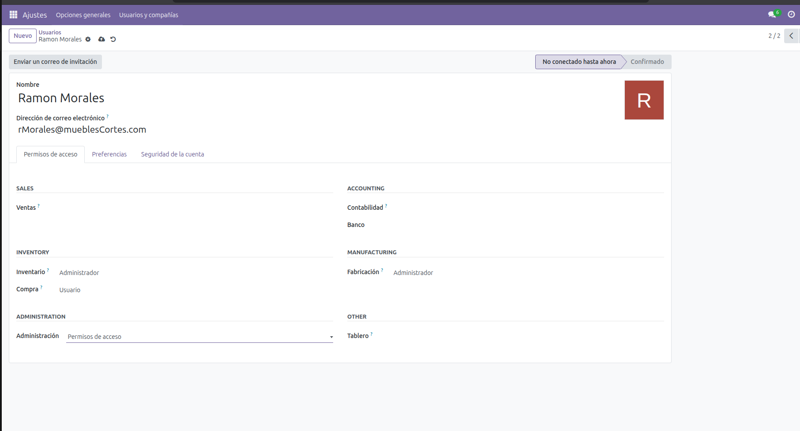
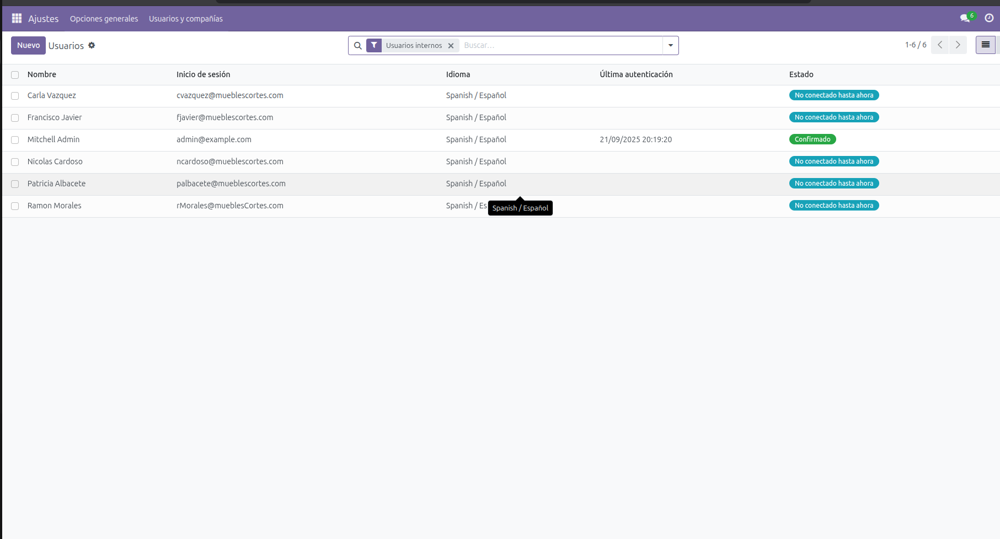
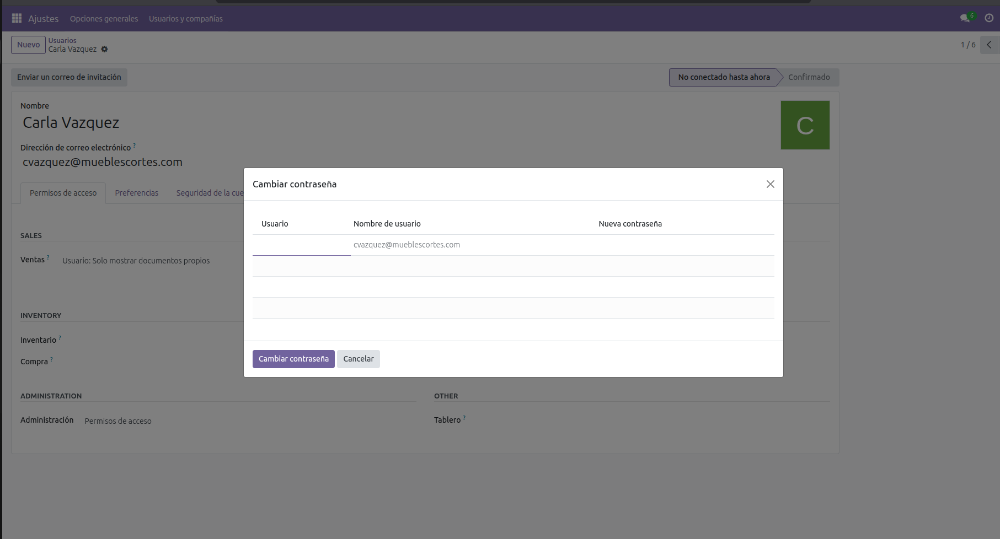
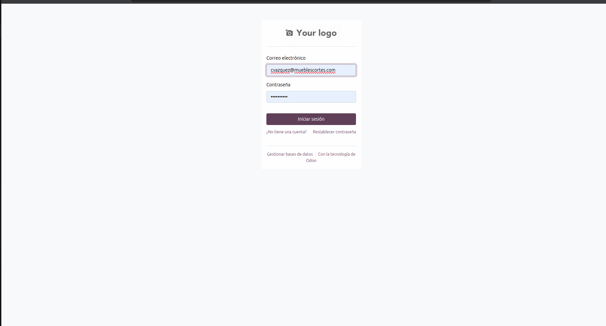
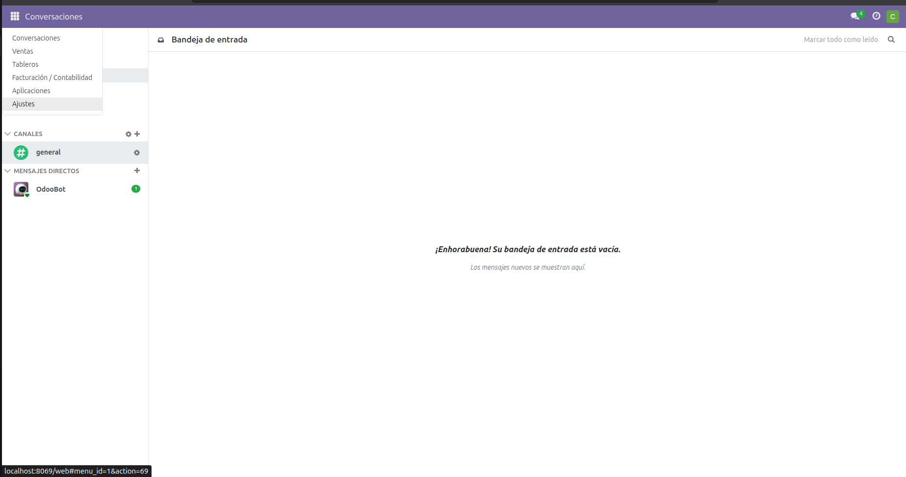

# USUARIOS.

## ACTIVACIÓN DE MODULOS.

Primero de todo antes de adentrarnos en lel funcionamiento de los modulos y en hacer que el flujo funcione. Vamos a encargarnos de crear los usuarios basicos de cada parte del proceso, con el fin de tener la estructura empresarial semidefinida.

Vamos a asignar distintos tipos de usuarios.
-Comercial --> usuario de ventas.
-Jefe Producción --> Encargado de toda la produccion.
-Operario --> Usuario en produccion.
-Responsable compras --> Administrador de compras.
-Contabilidad --> Encargado de la facturación de la empresa y de los     clientes.
-Director comercial --> Encargado de todas las ventas.

Realizada la estructura procedemos en el menu donde de aplicaciones de Odoo, vamos a activar los siguientes modulos.

- Ventas.
- Compras.
- Facturación.
- Inventario.
- MRP.

## CREACION USUARIOS.

Para crear los usuarios nos dirijimos a menu Aplicaciones Ajustes, justamente en la parte izquierda donde podemos ver el cuadrado.

Una vez alli vamos a usuarios y compañias en el apartado de Usuarios. Nos vamos a encontrar con la lista de usuarios, por defecto, vamos a encontrar dos el nuestro y uno de prueba. Eliminamos ese usuario.

Cuando hayamos realizado este paso vamos a crear los usuarios. Arriba donde pone nuevo.

**IMPORTANTE**
En la parte inferior en administracion, se tiene que poner permisos de acceso para que el usuario este capado por roles.

**DIFERENCIACION**
Usuario --> Puede ver cosas del modulo validar algun apartado.
Administrador --> Es el encargado de todo el departamento y tiene todos los permisos en ese departamento.

.

Una vez hemos creado a todos los usuarios con todos los permisos, vamos a ver que estan en la lista. Y procederemos a darles contraseña a cada uno. 

.

.

Una vez le damos contraseña al usuario. Vamos a testear que los permisos estan bien configurados.
-Cerramos nuestra sesion y intentamos acceder desde el que hemos asignado la contraseña.

.

Podemos ver en la siguiente imagen como el usuario Carla Vazquez cvazquez@mueblescortes.com. 

Quien tiene el rol de comercial, solamente puede ver la parte de ventas y de facturación. Tal y como se le ha asignado.

.
