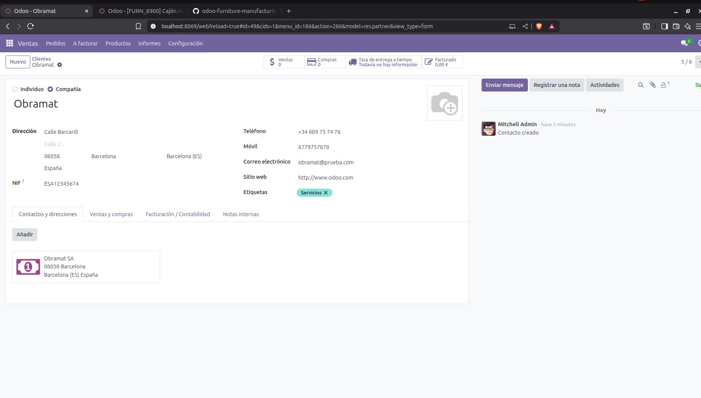
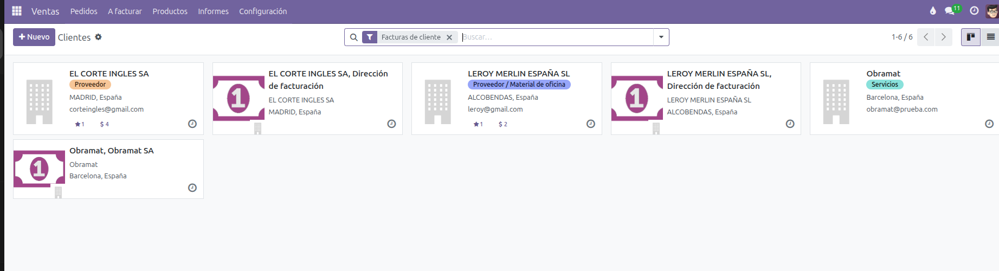
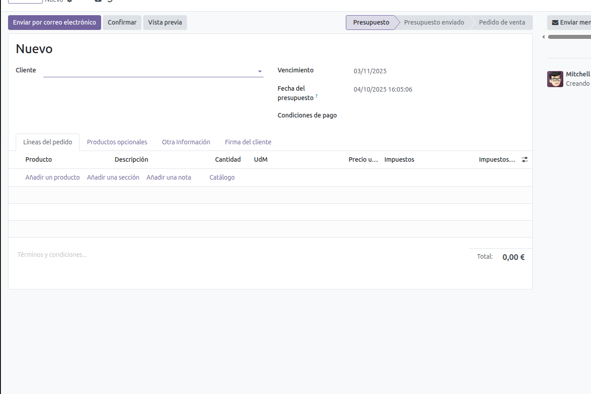
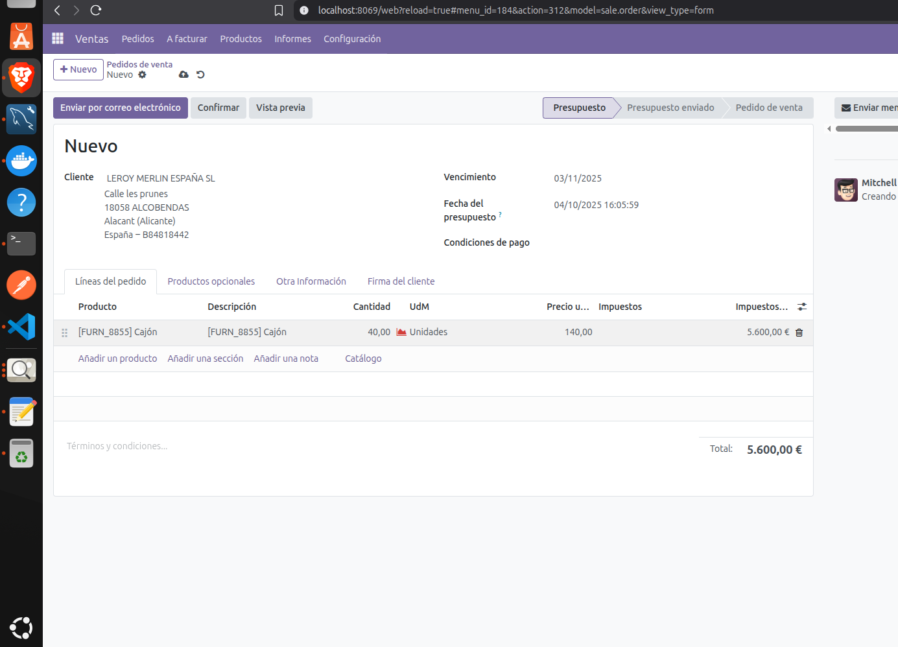
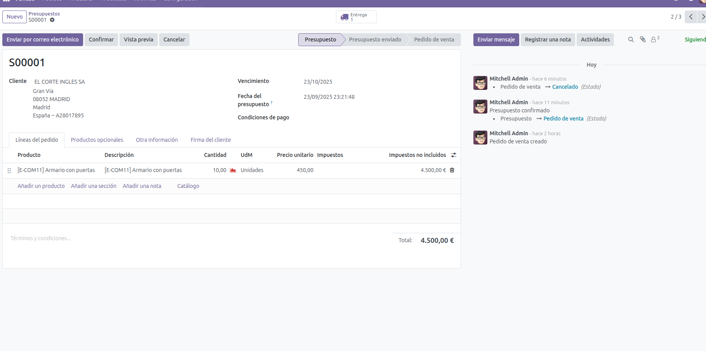
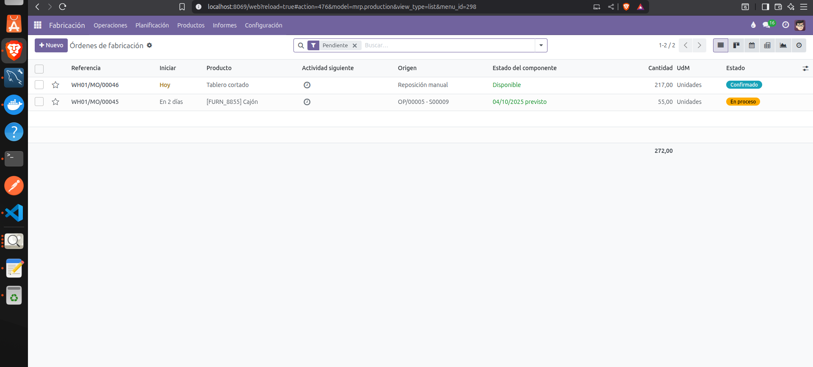
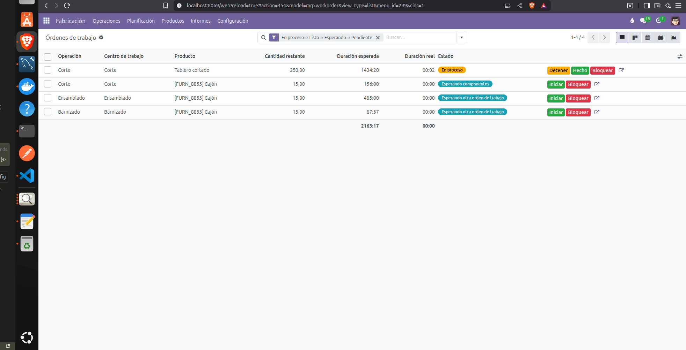

# VENTAS.

## CLIENTES.

Una vez hemos configurado todo el ciclo de manufacturación. Procediremos a introducir un paso previo que es el de cuando se realiza una venta. En este paso para empezar instalaremos el modulo de ventas, si no lo hicimos anteriormente, y iremos a el concretamente. Ventas -> Pedidos -> Cliente.

Una vez estamos en el modulo le damos a nuevo y procedemos a crear el cliente.
-Añadimos la información del cliente y la dirección de facturación.

**Dirección de facturación**-> Dirección secundaria vinculada, es el lugar donde evia las facturas.
**Compañia** -> Entidad principal, contiene los datos generales y es donde se crean los pedidos de venta
.

Después de crear varios clientes, vamos a verificar si se han creado bien en la lista. 

.

**El siguiente paso será revisar que los articulos tengan el check de venta, si no se podrán vender.** También verificamos que el tipo de producto sea almacenable y que el procedimiento de los modulos anteriores este bien. Ruta, metodo, el precio de venta y el coste.

## PEDIDO.

Una vez tenemos configurado la base,v amos a procoder a generar los pedidos.
Ventas -> Pedidos -> Pedido.
.

Procedemos a crear el nuevo pedido. Elejimos el cliente que va a realizar el pedido, después añadimos en la linea los productos que va a tener el pedido, una vez esta añadido el producto y su cantidad, entonces confirmaremos.

**IMPORTANTE--> Al confirmar, Odoo, revisa automaticamente la tabla en la base de datos de stock. Y mirará si tenemos stock para satisfacer el pedido. Entonces si hay suficiente stock pasará directamente el pedido a la siguiente fase. Pero si no, creará automaticamente una MO.**

-Por eso, para ver el proceso en la demo, vamos a crear un pedido donde no tengamos stock y se tenga de fabricar para realizar todo el flujo del proceso. Pedido-> Orden de fabricación -> Orden de trabajo -> Entrega -> Facturación.
.

Se lanza un presupuesto, y después de confirmar el presupuesto. Se realiza el pedido ficticio.
.

Realizamos un pedido ficticio de 40 cajones. En su BoM, nos faltan tableros, por ende, si no se cortan los tableros no se podrán montar en su totalidad. Aquí vemos, que se lanzan dos MO, la de tableros y posteriormente la de los cajones.

.

Consecutivamente a la que planificamos las MO, se ordenan las ordenes de trabajo.
.

